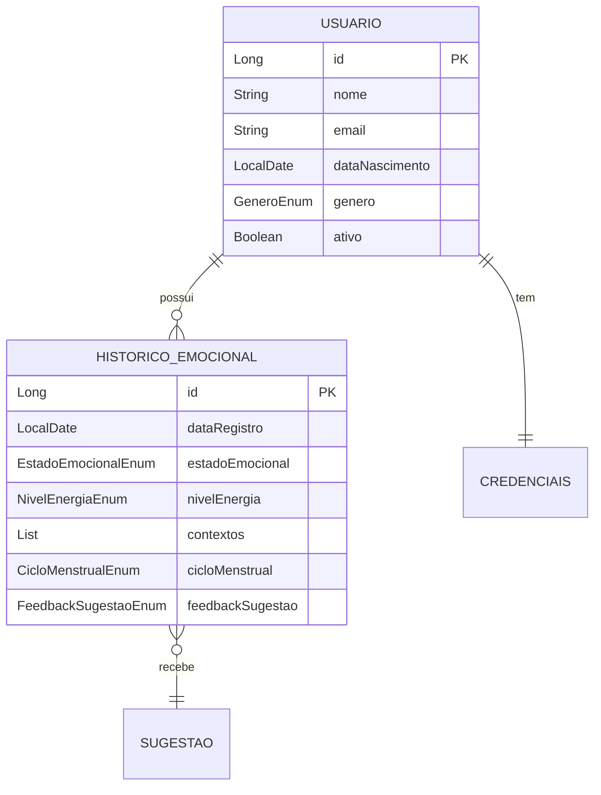

# 🧠 Mental Health Management API

[](https://www.oracle.com/java/)
[](https://spring.io/projects/spring-boot)
[](https://www.mysql.com/)
[]()

> **Plataforma inteligente de gestão de saúde mental** que ajuda usuários a rastrear emoções, energia, contextos e receber sugestões personalizadas baseadas em algoritmos de Machine Learning.

---

## 🌟 Visão Geral

Este projeto foi desenvolvido para demonstrar **arquitetura de software moderna**, **clean code** e **design patterns** em uma aplicação real de saúde mental.

### 🎯 **Problema Resolvido**
Milhões de pessoas lutam com saúde mental, mas não têm ferramentas acessíveis para **autoconhecimento emocional**. Este app resolve isso oferecendo:
- ✅ Check-in emocional diário
- ✅ Sugestões inteligentes baseadas em emoção × energia × contexto
- ✅ Histórico completo com análise de padrões
- ✅ Suporte a ciclo menstrual (para mulheres)

---

## 🏗️ Arquitetura

### **Clean Architecture + Domain-Driven Design**

```
┌─────────────────────────────────────────────┐
│           Presentation Layer                │
│  (Controllers - API REST Endpoints)         │
└────────────────┬────────────────────────────┘
                 │
┌────────────────▼────────────────────────────┐
│           Business Layer                    │
│  (Services - Lógica de Negócio)            │
│  • SugestaoService (ML-like algorithm)     │
│  • HistoricoEmocionalService               │
└────────────────┬────────────────────────────┘
                 │
┌────────────────▼────────────────────────────┐
│           Persistence Layer                 │
│  (Repositories - Acesso a Dados)           │
│  • Spring Data JPA + Hibernate             │
└────────────────┬────────────────────────────┘
                 │
┌────────────────▼────────────────────────────┐
│           Database Layer                    │
│  MySQL 8.0 + Flyway Migrations             │
└─────────────────────────────────────────────┘
```

### **Design Patterns Implementados:**
- ✅ **Repository Pattern** (abstração de acesso a dados)
- ✅ **DTO Pattern** (separação de camadas)
- ✅ **Strategy Pattern** (sugestões baseadas em regras)
- ✅ **Builder Pattern** (construção de objetos complexos)
- ✅ **Dependency Injection** (Spring IoC)

---

## 🚀 Funcionalidades

### **Core Features:**

#### **1. Sistema de Sugestões Inteligentes**
```java
// Algoritmo proprietário baseado em matriz multi-dimensional
Emoção (6) × Energia (5) × Contexto (6) × Ciclo (3) = 540 combinações

Exemplo:
Input:  ANSIOSO + ENERGIA_BAIXA + CONTEXTO_TRABALHO
Output: "Pausas Estratégicas" → "Faça pausas de 5 min a cada 25 min (Pomodoro)..."
```

#### **2. Machine Learning Simples**
```java
// Sistema aprende preferências do usuário
Feedback: ACEITA  → +1.0 score
Feedback: RECUSADA → -0.5 score
Feedback: ALTERNATIVA → 0.0 score

// Sugestões futuras são ordenadas por score
```

#### **3. Suporte a Ciclo Menstrual**
```java
// Prioridade 1: Menstruação + Cólica → Sugestões específicas
if (cicloMenstrual == SIM_MENSTRUADA && sintomas.contains(COLICA)) {
    return getSugestaoMenstrualComColica(emocao, energia);
}
```

---

## 📊 Modelo de Dados

### **Entidades Principais:**



---

## 🛠️ Tecnologias

### **Backend:**
- **Java 17** (LTS)
- **Spring Boot 3.3.4** (Framework)
- **Spring Security + JWT** (Autenticação)
- **Spring Data JPA** (ORM)
- **Hibernate** (Mapeamento objeto-relacional)
- **MySQL 8.0** (Banco de dados)
- **Flyway** (Migrations)
- **Maven** (Gerenciador de dependências)
- **Lombok** (Redução de boilerplate)

### **Planejado (Android):**
- **Kotlin** (Linguagem)
- **Jetpack Compose** (UI moderna)
- **MVVM + Clean Architecture**
- **Retrofit** (HTTP client)
- **Room** (Cache local)
- **Hilt** (Dependency Injection)
- **Material Design 3**

---

## 📡 API Endpoints

### **Autenticação**
```http
POST /login
Content-Type: application/json

{
  "login": "maria@exemplo.com",
  "senha": "senha123"
}

→ 200 OK
{
  "token": "eyJhbGciOiJIUzI1NiIsInR5cCI6IkpXVCJ9..."
}
```

### **Obter Sugestão Personalizada**
```http
POST /usuarios/{id}/sugestao
Authorization: Bearer {token}
Content-Type: application/json

{
  "estadoEmocional": "ANSIOSO",
  "nivelEnergia": "BAIXO",
  "contextos": ["TRABALHO", "SONO"],
  "cicloMenstrual": "NAO_APLICAVEL",
  "sintomasFisicos": []
}

→ 200 OK
{
  "titulo": "Pausas Estratégicas",
  "descricao": "Faça pausas de 5 min a cada 25 min...",
  "categoria": "Produtividade",
  "duracao": "5 min",
  "razao": "Ansiedade com baixa energia requer micro-descansos...",
  "alternativas": [
    "Respiração 4-7-8 (relaxamento rápido)",
    "Caminhada de 10 min ao ar livre",
    "Alongamento suave na cadeira"
  ]
}
```

### **Registrar Check-in com Feedback**
```http
POST /usuarios/{id}/historico-completo
Authorization: Bearer {token}

{
  "estadoEmocional": "ANSIOSO",
  "nivelEnergia": "BAIXO",
  "contextos": ["TRABALHO"],
  "cicloMenstrual": "NAO_APLICAVEL",
  "sintomasFisicos": [],
  "sugestaoId": 42,
  "feedbackSugestao": "ACEITA"
}

→ 201 Created
```

---

## 🏃 Como Executar

### **1. Pré-requisitos:**
```bash
- Java 17+
- MySQL 8.0
- Maven 3.8+
```

### **2. Configurar Banco de Dados:**
```sql
CREATE DATABASE gestaosaudemental_api;
```

### **3. Configurar Variáveis de Ambiente:**
```bash
export DB_USERNAME=seu_usuario
export DB_PASSWORD=sua_senha
```

Ou copie o template:
```bash
cp src/main/resources/application.properties.example src/main/resources/application.properties
# Edite com suas credenciais
```

### **4. Executar:**
```bash
mvn clean install
mvn spring-boot:run
```

API estará disponível em: `http://localhost:8080`

---

## 🧪 Testes

```bash
# Executar todos os testes
mvn test

# Executar com coverage
mvn clean test jacoco:report

# Ver relatório
open target/site/jacoco/index.html
```

---

## 📈 Próximas Melhorias

- [ ] **Testes Unitários** (Coverage > 80%)
- [ ] **Swagger/OpenAPI** (Documentação interativa)
- [ ] **Docker Compose** (Setup com 1 comando)
- [ ] **CI/CD Pipeline** (GitHub Actions)
- [ ] **Deploy em Produção** (Railway/Heroku)
- [ ] **App Android Nativo** (Kotlin + Jetpack Compose)
- [ ] **WebSockets** (Notificações em tempo real)
- [ ] **Redis Cache** (Performance)

---

## 🤝 Contribuindo

Este é um projeto **privado em desenvolvimento** para comercialização futura.

Se você tem acesso a este repositório e deseja contribuir:

1. Crie uma branch (`git checkout -b feature/nova-funcionalidade`)
2. Commit suas mudanças (`git commit -m 'Adiciona nova funcionalidade'`)
3. Push para a branch (`git push origin feature/nova-funcionalidade`)
4. Abra um Pull Request

---

## 📄 Licença

Este projeto é **propriedade privada**. Todos os direitos reservados.

**Não é permitido:**
- ❌ Distribuição
- ❌ Modificação
- ❌ Uso comercial sem autorização

---

## 👨‍💻 Autor

**Everson Rubira**

- 🌐 Portfolio: [em construção]
- 💼 LinkedIn: [seu-linkedin]
- 📧 Email: [seu-email]

---

## 🎯 Propósito do Projeto

Este projeto demonstra:
- ✅ **Arquitetura de Software** (Clean Architecture, DDD)
- ✅ **Design Patterns** (Repository, DTO, Strategy)
- ✅ **Backend Robusto** (Spring Boot, JWT, MySQL)
- ✅ **Algoritmos Inteligentes** (Sistema de sugestões ML-like)
- ✅ **Modelagem de Dados** (Normalização, relações complexas)
- ✅ **Segurança** (JWT, hashing de senhas, proteção de endpoints)
- ✅ **Migrations** (Flyway para versionamento de DB)

---

**⭐ Se você tem acesso a este projeto e gostou, considere deixar uma estrela!**

---

*Última atualização: 2025-11-25*
